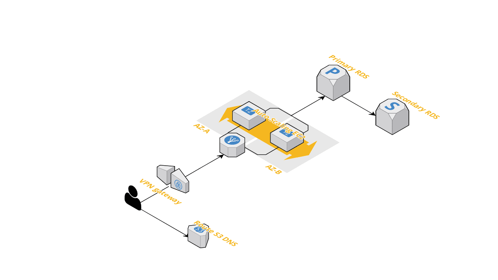

# Locale.ai Backend Task
### Task Statement:
 XRides, delivers about a 200 rides per minute or 288,000 rides per day. Now, they want to send this data to your system via an API. Your task is to create this API and save the data into PostgreSQL. The API should be designed, keeping in mind the real-time streaming nature of data and the burst of requests at peak times of the day. The user of this API expects an acknowledgment that the data is accepted and a way to track if the request fails.

* Brownie Points:

1. Write a query DSL of how you would want this data to be queried and how someone would be able to run analytics operations on top of it.
2. Write up on the ideal system architecture and the design of API given enough time and resources.

Ideal Tech Stack : Python/Go.

### Implementation details
This API will be tested at peak times of the day when there are write requests incoming, so the primary objective here was to ease the load  database as the Postgresql server would be the first bottleneck here. For that a redis write-buffer is implemented that will store the validated data into redis, [Redis’s Reliable Queue](https://redis.io/commands/rpoplpush#pattern-reliable-queue) pattern. A celery scheduler will then pop <user_defined_value> of elements from  redis and write it onto the Postgresql database via a bulk insert operation, which will be much faster than a single writes hence reducing the load on the database.


* **Query DSL**

    For implementing a OLAP system I would run a Airflow ETL pipeline from the amazon RDS to Apache Superset which would be then used for the analytics.

* **Ideal system Architecture**

	To avoid vendor lockins and easy migrations I wanted to use in house solutions rather than relying too much on the vendor specific features and systems, hence this architecture could be easily implemented via different cloud vendors.
    


### Settings up

* Pre-requisites
	* docker-compose

```
docker-compose build
docker-compose up
```
